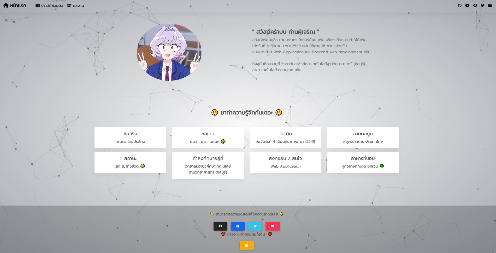
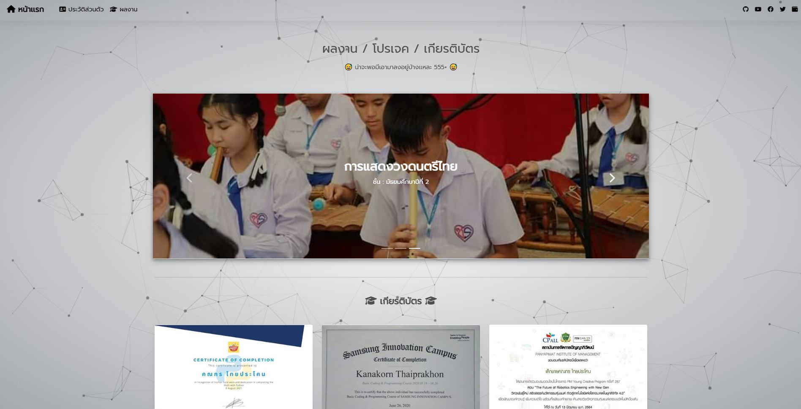
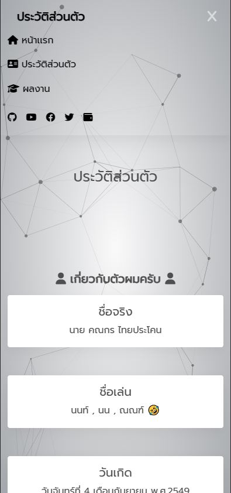

<h1>🚀 My Personal Portfolio Website 🚀</h1>

- node v18.11.0
- yarn v1.22.19

<h2>📸 Previews</h2>

<h2>🛠 Install</h2>

0) หากยังไม่มี Yarn ใช้คำสั่งติดตั้ง Windows : `npm install -g yarn` หรือ Linux : `sudo npm install -g yarn`
1) config port ไปที่ไฟล์ `./configs/config.js` ตั้งค่า **port** เเละ **address** ให้เรียนร้อย
2) `yarn install`
3) `yarn start` หรือ `yarn dev` สำหรับ Nodemon

้<h1>🎃  LOL  🎃</h1>